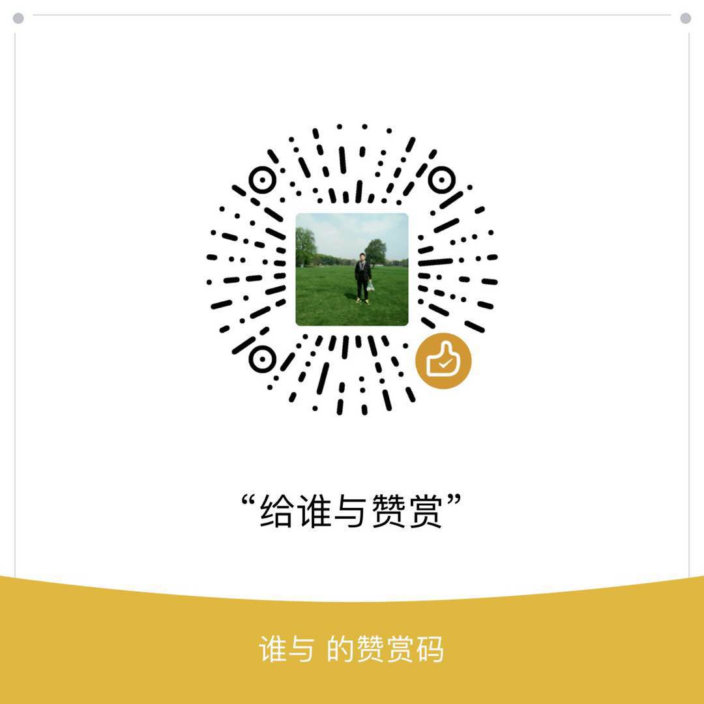

#applyun
聊天机器人

# Python3.7 实现 微信自动与好友或朋友群聊天

    pip3 install requests
    pip3 install wxpy
    pip3 install argparse

# 配置

    http://www.tuling123.com/
    在图灵网站上注册，获取 apikey 和 userid -> resources->/conf/setting.conf

    windows配置参数 ->
    -m friend -u 好友备注 -c 打招呼语 -a False
    -m group -u 群聊备注 -c 打招呼语 -a False

# 关于赞助
欢迎一起探讨学习新知识->
本着自愿原则进行赞赏

